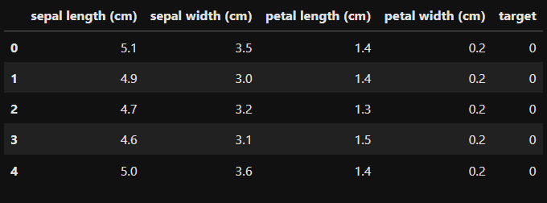

# SGD-Classifier
## AIM:
To write a program to predict the type of species of the Iris flower using the SGD Classifier.

## Equipments Required:
1. Hardware – PCs
2. Anaconda – Python 3.7 Installation / Jupyter notebook

## Algorithm
1. Load the Iris dataset and convert it into a Pandas DataFrame.
2. Split the DataFrame into features (X) and target (y).
3. Divide the data into training and testing sets.
4. Initialize an SGD classifier with specified parameters.
5. Train the classifier using the training data.
6. Predict the target values for the test data.
7. Calculate and display the accuracy and confusion matrix. 

## Program:
```
/*
Program to implement the prediction of iris species using SGD Classifier.
Developed by: Nanda Kishor Suresh Priya
RegisterNumber: 212224040210
*/
```

```python
# import the necessary libraries
import pandas as pd
from sklearn.datasets import load_iris
from sklearn.linear_model import SGDClassifier
from sklearn.model_selection import train_test_split
from sklearn.metrics import accuracy_score, confusion_matrix
import matplotlib.pyplot as plt
import seaborn as sns
```

```python
# Load the Iris dataset
iris = load_iris()
```

```python
# Create a Pandas DataFrame
df = pd.DataFrame(data=iris.data, columns=iris.feature_names)
df['target'] = iris.target
```

```python
# Displaying the first few values
df.head()
```

```python
# Spliting the data into features (X) and target (y)
X = df.drop('target', axis=1)
y = df['target']
```

```python
# Spliting the data into training and testing sets
X_train, X_test, y_train, y_test = train_test_split(X, y, test_size=0.2, random_state=7)
```

```python
# Creating an SGD classifier with default parameters
sgd_clf = SGDClassifier(max_iter=1000, tol=1e-3)
```

```python
# Train the classifier on the training data
sgd_clf.fit(X_train, y_train)
```

```python
# Make predictions on the testing data
y_pred = sgd_clf.predict(X_test)
```

```python
# Evaluate the classifier's accuracy
accuracy = accuracy_score(y_test, y_pred)
print(f"Accuracy: {accuracy*100}%")
```

```python
# Calculate the confusion matrix
cm = confusion_matrix(y_test, y_pred)
print("Confusion Matrix:")
print(cm)
```

## Output:

### Head Values - DataFrame(Iris)
  

### Fitting Training Data on the SGDClassifier
  

### Model Accuracy
  

### Confusion Matrix
  

## Result:
Thus, the program to implement the prediction of the Iris species using SGD Classifier is written and verified using Python programming.
